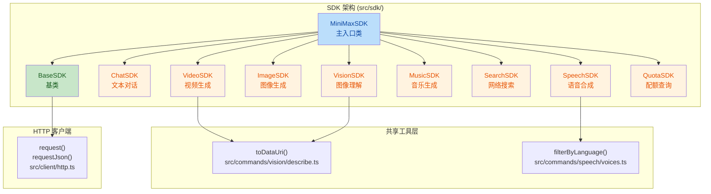
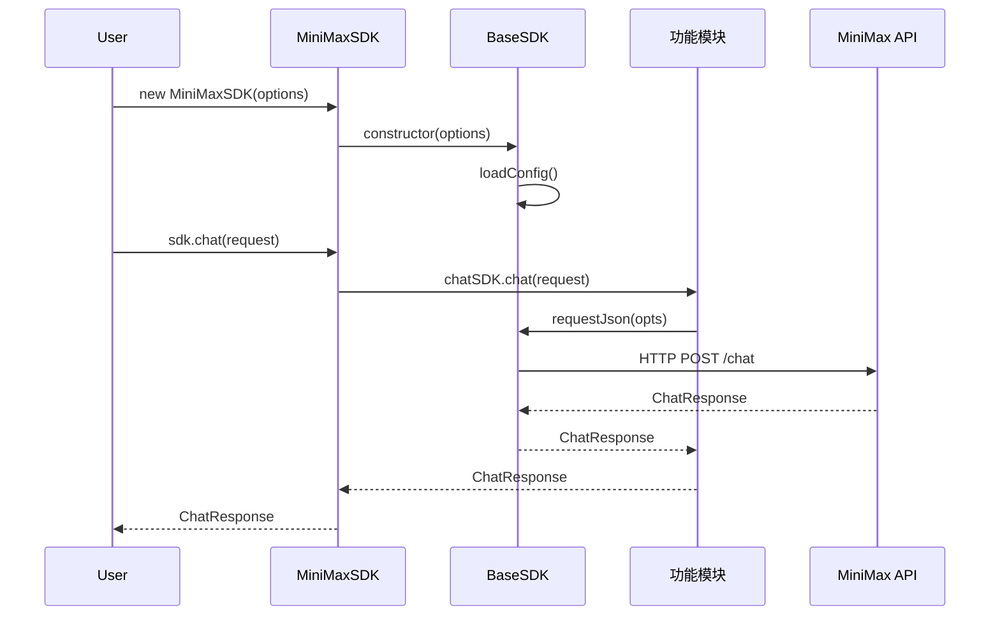

## 1. 高层摘要 (TL;DR)

**影响范围：高** - 这是一个重大的架构重构，将项目从 CLI 工具转换为可编程的 Node.js SDK

**核心变更：**
- 🔄 **项目定位转变**：从 `mmx-cli` (命令行工具) 重构为 `mmx-sdk` (软件开发工具包)
- 🏗️ **新增 SDK 架构**：创建了完整的面向对象 SDK 层，包含 `BaseSDK` 基类和多个功能模块
- 📦 **构建系统升级**：从单文件 CLI 构建改为带 TypeScript 类型定义的库构建
- 📚 **文档重写**：README 从命令参考改为完整的 API 文档
- 🎨 **新增示例代码**：添加了 7 个 TypeScript 示例文件展示 SDK 用法

---

## 2. 可视化概览 (代码与逻辑映射)





---

## 3. 详细变更分析

### 🏗️ 项目配置与构建

#### package.json
**变更内容：** 项目从 CLI 工具转换为 NPM 库

| 配置项 | 旧值 | 新值 | 说明 |
|--------|------|------|------|
| `name` | `mmx-cli` | `mmx-sdk` | 包名变更 |
| `description` | CLI for the MiniMax AI Platform | SDK for the MiniMax AI Platform | 描述更新 |
| `bin` | `{"mmx": "dist/mmx.mjs"}` | *(删除)* | 移除 CLI 入口 |
| `main` | *(无)* | `./dist/index.js` | 库主入口 |
| `types` | *(无)* | `./dist/index.d.ts` | TypeScript 类型定义 |
| `exports` | *(无)* | `{".": "./dist/index.js"}` | ES 模块导出 |
| `keywords` | *(无)* | `["mmx", "minimax", "sdk", "ai"]` | 关键词 |
| `license` | *(无)* | `MIT` | 添加 MIT 许可证 |
| `author` | *(无)* | FliPPeDround | 添加作者信息 |
| `repository` | *(无)* | GitHub 仓库地址 | 添加仓库信息 |

#### build.ts
**变更内容：** 构建脚本从 CLI 构建改为 SDK 库构建

```typescript
// 旧构建：CLI 单文件
entrypoints: ['src/main.ts'],
outdir: 'dist',
naming: 'mmx.mjs',
target: 'node',
minify: true,
define: { 'process.env.CLI_VERSION': JSON.stringify(VERSION) }

// 新构建：SDK 库 + 类型定义
entrypoints: ['./src/sdk/index.ts'],
outdir: './dist',
plugins: [dts()],  // 添加 TypeScript 类型生成插件
```

**新增依赖：** `bun-plugin-dts@^0.4.0` - 用于生成 `.d.ts` 类型定义文件

---

### 📦 核心架构 (src/sdk/)

#### src/sdk/base.ts (新增)
**功能：** SDK 基类，提供配置管理和 HTTP 请求封装

```typescript
export class BaseSDK {
  protected config: Config;
  
  constructor(options: BaseSDKOptions) {
    this.config = loadConfig({
      apiKey, region, baseUrl, timeout,
      quiet: true, verbose: false,
      noColor: true, yes: false,
      dryRun: false, help: false,
      nonInteractive: false, async: false
    });
  }
  
  protected request(opts: RequestOpts) {
    return requestClient(this.config, opts);
  }
  
  protected requestJson<T>(opts: RequestOpts): Promise<T> {
    return requestJsonClient<T>(this.config, opts);
  }
}
```

**关键特性：**
- 统一配置加载机制
- 提供 `request()` 和 `requestJson<T>()` 两个受保护方法
- 所有功能 SDK 继承此基类

#### src/sdk/index.ts (新增)
**功能：** SDK 主入口类，聚合所有功能模块

```typescript
export class MiniMaxSDK extends BaseSDK {
  private chatSDK: ChatSDK;
  private speechSDK: SpeechSDK;
  private imageSDK: ImageSDK;
  private videoSDK: VideoSDK;
  private musicSDK: MusicSDK;
  private searchSDK: SearchSDK;
  private visionSDK: VisionSDK;
  private quotaSDK: QuotaSDK;
  
  constructor(options: MiniMaxSDKOptions) {
    super(options);
    // 初始化所有功能模块
  }
  
  // 核心方法
  chat(request): Promise<ChatResponse | AsyncGenerator<StreamEvent>>
  speech(request): Promise<SpeechResponse | AsyncGenerator<SpeechResponse>>
  voices(language?): Promise<SystemVoiceInfo[]>
  generateImage(request): Promise<ImageResponse>
  generateVideo(request): Promise<VideoResponse | {taskId: string}>
  getVideoTask({taskId}): Promise<VideoTaskResponse>
  downloadVideo(request): Promise<DownloadResult>
  generateMusic(request): Promise<MusicResponse | AsyncGenerator<Uint8Array>>
  search({query}): Promise<SearchResponse>
  describeImage(request): Promise<VlmResponse>
  getQuota(): Promise<QuotaResponse>
}
```

**设计亮点：**
- 使用 TypeScript 函数重载支持流式和非流式两种模式
- 每个方法都有明确的类型定义
- 导出所有 API 类型供用户使用

---

### 🎯 功能模块

#### src/sdk/text/chat.ts (新增)
**功能：** 文本对话模块

| 方法 | 说明 | 特性 |
|------|------|------|
| `chat(request)` | 发送聊天消息 | 支持流式/非流式、多轮对话、SSE 解析 |

**默认参数：**
- `model`: `MiniMax-M2.7`
- `max_tokens`: `4096`

#### src/sdk/image/generate.ts (新增)
**功能：** 图像生成模块

| 方法 | 说明 | 默认值 |
|------|------|--------|
| `generate(request)` | 生成图像 | `model: "image-01"`, `n: 1` |

#### src/sdk/music/generate.ts (新增)
**功能：** 音乐生成模块，支持丰富的结构化参数

**新增参数扩展：**
```typescript
interface MusicGenerateRequest extends MusicRequest {
  vocals?: string;      // 人声风格
  genre?: string;       // 音乐流派
  mood?: string;        // 情绪
  instruments?: string; // 乐器
  tempo?: string;       // 节拍描述
  bpm?: number;         // 精确 BPM
  key?: string;         // 调式
  avoid?: string;       // 避免元素
  use_case?: string;    // 使用场景
  structure?: string;   // 歌曲结构
  references?: string;  // 参考曲目
  extra?: string;       // 额外要求
  instrumental?: boolean; // 纯音乐
  useCase?: string;     // 使用场景
}
```

**特性：**
- `buildPrompt()` 方法将结构化参数转换为自然语言提示
- 支持流式音频输出
- 默认音频设置：`format: mp3`, `sample_rate: 44100`, `bitrate: 256000`

#### src/sdk/video/generate.ts (新增)
**功能：** 视频生成模块，支持异步任务

| 方法 | 说明 | 特性 |
|------|------|------|
| `generate(request)` | 生成视频 | 支持 `async: true` 返回 taskId |
| `getTask({taskId})` | 查询任务状态 | 轮询直到完成或失败 |
| `download(request)` | 下载视频 | 通过 fileId 下载 |

**默认参数：**
- `model`: `MiniMax-Hailuo-2.3`
- `pollInterval`: 5 秒
- `timeout`: 使用配置的超时时间

#### src/sdk/speech/synthesize.ts (推断新增)
**功能：** 语音合成模块

**特性：**
- 支持流式/非流式输出
- `voices(language?)` 方法获取可用音色

#### src/sdk/vision/describe.ts (新增)
**功能：** 图像理解模块

```typescript
interface ImageDescribeRequest {
  prompt?: string;  // 默认: "Describe the image."
  image: string;    // 文件路径、URL 或 file ID
}
```

#### src/sdk/search/query.ts (新增)
**功能：** 网络搜索模块

```typescript
interface SearchResponse {
  organic: SearchResult[];  // 搜索结果列表
}

interface SearchResult {
  title: string;
  link: string;
  snippet: string;
  date: string;
}
```

#### src/sdk/quota/show.ts (新增)
**功能：** 配额查询模块

```typescript
interface QuotaResponse {
  // 配额信息
}
```

---

### 🔄 工具函数导出

#### src/commands/vision/describe.ts
**变更：** 将 `toDataUri()` 函数导出

```typescript
// 从私有函数改为导出函数
export async function toDataUri(image: string): Promise<string>
```

**用途：** 将图像路径、URL 转换为 Data URI 格式，供 SDK 使用

#### src/commands/speech/voices.ts
**变更：** 将 `filterByLanguage()` 函数导出

```typescript
// 从私有函数改为导出函数
export function filterByLanguage(voices: SystemVoiceInfo[], language: string)
```

**用途：** 按语言筛选音色列表

---

### 📚 文档更新

#### README.md & README_CN.md
**变更内容：** 完全重写，从 CLI 命令参考改为 SDK API 文档

**主要变化：**

| 章节 | CLI 版本 | SDK 版本 |
|------|----------|----------|
| 标题 | The official CLI for the MiniMax AI Platform | SDK for the MiniMax AI Platform |
| 安装 | `npm install -g mmx-cli` | `npm install mmx-sdk` |
| 快速开始 | Bash 命令示例 | TypeScript 代码示例 |
| 命令参考 | `mmx text`, `mmx image` 等 | `sdk.chat()`, `sdk.generateImage()` 等 |
| 贡献者 | 贡献者头像 | *(删除)* |

**新增 API 文档章节：**
- `new MiniMaxSDK(options)` - SDK 初始化
- `sdk.chat(request)` - 文本对话
- `sdk.speech(request)` - 语音合成
- `sdk.voices(language?)` - 获取音色
- `sdk.generateImage(request)` - 图像生成
- `sdk.generateVideo(request)` - 视频生成
- `sdk.getVideoTask({ taskId })` - 视频任务查询
- `sdk.downloadVideo(request)` - 视频下载
- `sdk.generateMusic(request)` - 音乐生成
- `sdk.search({ query })` - 网络搜索
- `sdk.describeImage(request)` - 图像理解
- `sdk.getQuota()` - 配额查询

---

### 📝 示例代码 (examples/)

#### 新增示例文件

| 文件 | 功能 | 核心代码 |
|------|------|----------|
| `chat.ts` | 文本对话 | `sdk.chat({ messages: [...] })` |
| `image.ts` | 图像生成 | `sdk.generateImage({ prompt: '...' })` |
| `music.ts` | 音乐生成 | `sdk.generateMusic({ prompt, lyrics })` |
| `quota.ts` | 配额查询 | `sdk.getQuota()` |
| `speech.ts` | 语音合成 | `sdk.speech({ text, voice_setting })` |
| `vision.ts` | 图像理解 | `sdk.describeImage({ image, prompt })` |

**示例特点：**
- 所有示例使用 `region: 'cn'` 配置
- 展示了 SDK 的核心用法
- 音乐示例包含完整的歌词内容

---

## 4. 影响与风险评估

### ⚠️ 破坏性变更

| 变更类型 | 旧行为 | 新行为 | 影响范围 |
|----------|--------|--------|----------|
| **包名** | `mmx-cli` | `mmx-sdk` | 所有依赖方需要更新包名 |
| **安装方式** | `npm install -g mmx-cli` | `npm install mmx-sdk` | 用户安装方式改变 |
| **使用方式** | 命令行 `mmx text chat` | 编程 API `sdk.chat()` | 完全不同的交互模式 |
| **入口文件** | `dist/mmx.mjs` (CLI) | `dist/index.js` (库) | 构建产物不同 |
| **导出内容** | CLI 命令 | SDK 类和类型 | API 完全重构 |

### ✅ 向后兼容性
- **无向后兼容性**：这是一个完全不同的产品定位
- CLI 功能可能已移除或保留在单独的包中

### 🧪 测试建议

**核心功能测试：**
1. **初始化测试**
   - 测试 `new MiniMaxSDK({ apiKey })` 基本初始化
   - 测试 `region` 参数自动检测
   - 测试自定义 `baseUrl` 和 `timeout`

2. **流式输出测试**
   - `sdk.chat({ stream: true })` 验证 SSE 流式解析
   - `sdk.speech({ stream: true })` 验证音频流式输出
   - `sdk.generateMusic({ stream: true })` 验证音乐流式输出

3. **异步任务测试**
   - `sdk.generateVideo({ async: true })` 验证 taskId 返回
   - `sdk.getVideoTask({ taskId })` 验证任务状态查询
   - 测试轮询超时和失败场景

4. **类型定义测试**
   - 验证所有导出类型正确
   - 测试 TypeScript 类型推断
   - 验证函数重载类型正确性

5. **错误处理测试**
   - 测试无效 API Key
   - 测试网络超时
   - 测试无效参数

**集成测试：**
- 运行所有 `examples/*.ts` 示例
- 验证与实际 MiniMax API 的兼容性

### 📌 注意事项

1. **API Key 管理**：SDK 不再提供 `mmx auth login` 命令，需要用户手动管理 API Key
2. **类型安全**：TypeScript 类型定义需要与实际 API 保持同步
3. **流式处理**：流式输出的内存使用需要监控，特别是大文件下载
4. **轮询策略**：视频生成的轮询间隔和超时时间需要根据实际场景调整

---

## 5. 总结

这次变更是一个**战略性重构**，将项目从终端用户工具转换为开发者工具包：

**优点：**
- ✅ 更灵活的集成方式，适合各种 Node.js 应用场景
- ✅ 完整的 TypeScript 类型支持，提升开发体验
- ✅ 模块化设计，易于扩展和维护
- ✅ 支持流式处理，适合实时应用

**挑战：**
- ⚠️ 完全不同的使用方式，需要用户重新学习
- ⚠️ 失去了 CLI 的便捷性（一键安装、全局使用）
- ⚠️ 需要用户具备一定的编程能力

**建议：**
- 考虑保留 CLI 版本作为独立包
- 提供更详细的迁移指南
- 增加更多实际场景的示例代码
